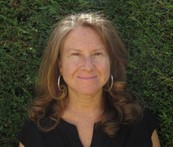
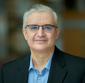

## Keynote Speaker’s Bios:

### Ana Armada Garcia:

Prof. Ana García Armada is currently a Professor at University Carlos III of Madrid, Spain, where she has served in a variety of management positions (Head of Signal Theory and Communications Department, Vice-dean of Electrical Engineering, Deputy Vice-Chancellor of International Relations, among others). She is leading the Communications Research Group at this university. She has been a visiting scholar at Stanford University, Bell Labs and University of Southampton. She has coordinated a large number national and international research projects as well as contracts with the industry, all of them related to wireless communications. She is the co-author of eight book chapters on wireless communications and signal processing. She has published more than 250 papers in international journals and conference proceedings and she holds six granted patents. She is serving on the editorial board of IEEE Open Journal of the Communications Society (Associate Editor in Chief since 2024) and ITU Journal on Future and Evolving. She has been a member of the organizing committee of IEEE MeditCom 2024 (General Chair), IEEE MeditCom 2023, IEEE WNCN 2024, IEEE Globecom 2022, IEEE Globecom 2021 (General Chair), IEEE Globecom 2019, IEEE Vehicular Technology Conference (VTC) Fall 2018, Spring 2018 and 2019, among others. She is now the Vice President of Member and Global Activities of IEEE Communications Society. She is an IEEE Fellow. She has received the Young Researchers Excellence Award from University Carlos III of Madrid. She was awarded the third place Bell Labs Prize 2014 for shaping the future of information and communications technology. She received the Outstanding service award from the IEEE ComSoc Signal Processing and Communications Electronics technical committee in 2019 and the Outstanding service award from the IEEE ComSoc Women in Communications Engineering Standing Committee in 2020. She received the IEEE ComSoc/KICS Exemplary Global Service Award in 2022.

### Mohamed-Slim Alouini:

Prof. Mohamed-Slim Alouini, was born in Tunis, Tunisia. He earned his Ph.D. from the California Institute of Technology (Caltech) in 1998 before serving as a faculty member at the University of Minnesota and later at Texas A&M University at Qatar. In 2009, he became a founding faculty member at King Abdullah University of Science and Technology (KAUST), where he currently is the Al-Khawarizmi Distinguished Professor of Electrical and Computer Engineering and the holder of the UNESCO Chair on Education to Connect the Unconnected. Dr. Alouini is a Fellow of the IEEE and OPTICA and his research interests encompass a wide array of research topics in wireless and satellite communications. He is currently particularly focusing on addressing the technical challenges associated with information and communication technologies (ICT) in underserved regions and is committed to bridging the digital divide by tackling issues related to the uneven distribution, access to, and utilization of ICT in rural, low-income, disaster-prone, and hard-to-reach areas.

-----

We will provide a detailed program as soon as possible.

Stay tuned!

---
